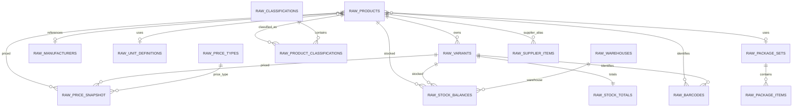
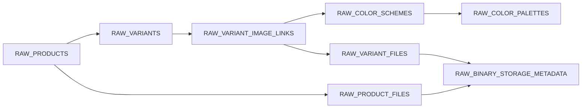
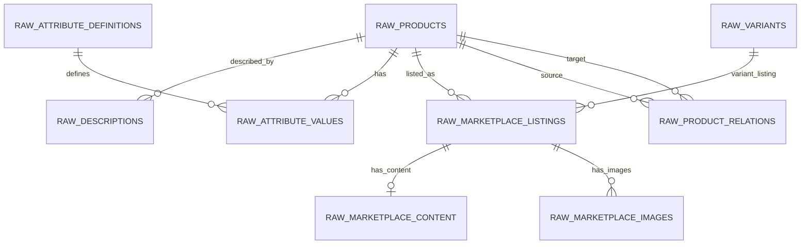
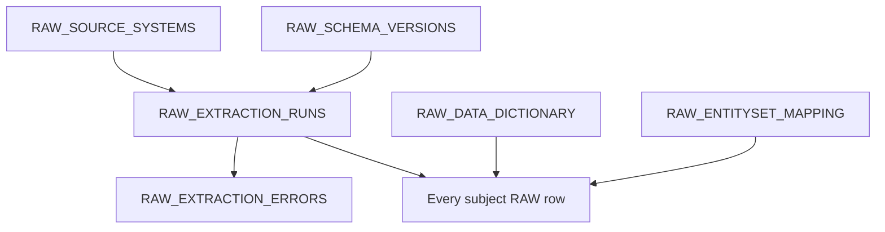

# RAW COMPLETE v1 — ER diagram

Диаграмма логическая; точные поля и FK определены в Data Dictionary.

## Core + Commercial

## Media

Ни RAW_PRODUCT_FILES, ни RAW_VARIANT_FILES не содержат Base64. RAW_BINARY_STORAGE_METADATA хранит только факт payload, длину, MIME и hash.

## Content + Marketplace + Relations

## Provenance

