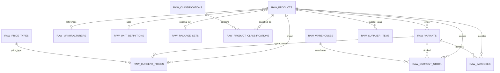
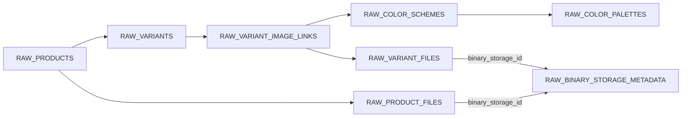
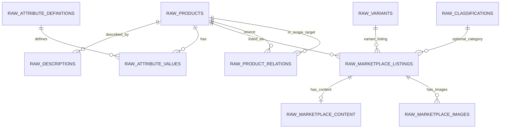
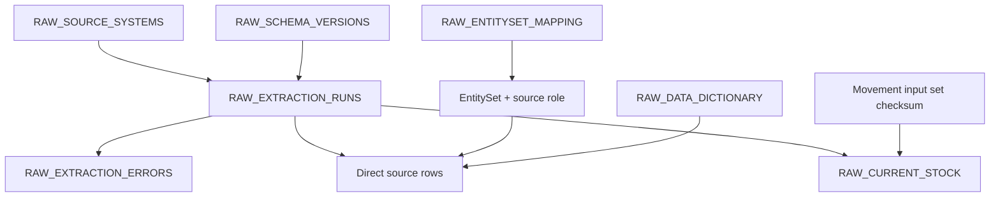

# RAW COMPLETE v1 — ER diagram after red-team revision

Статус: **REVISED — NOT OWNER APPROVED**. Точные fields, PK и FK определяет Data Dictionary.

## Core + current commercial snapshots

`RAW_PACKAGE_ITEMS` отсутствует в v1: 0 confirmed scoped rows. `Упаковка_Key` сохраняется как raw ID без выдуманного FK до type test; исходный child mapping остаётся control-only evidence в `RAW_EXTRACTION_RUNS`.

`RAW_CURRENT_STOCK` — current aggregate snapshot. У него нет fictitious single source-record FK. Lineage: cutoff + aggregation rule + source record count + canonical input checksum. Исходный total mapping сохранён как control-only lineage; `stock_total` — validation output `SUM(quantity_available)` по варианту, не физическая сущность.

## Media

`binary_storage_id` строится из exact pair `(file_id, file_type_raw)`. MIME/hash канонически находятся только в `RAW_BINARY_STORAGE_METADATA`. Base64/binary payload в Sheets отсутствуют.

## Content + marketplace + relations

Marketplace child FK использует один platform-qualified `listing_id`; source `Ref_Key` сохраняется отдельно. Recommendation target всегда сохраняется в `target_product_source_id`; `target_product_in_scope_id` заполняется только при membership в 204-product scope.

## Provenance

Direct source rows имеют `source_record_id`. Aggregated current stock имеет lineage input-set, а не ложную ссылку на одну source record.
